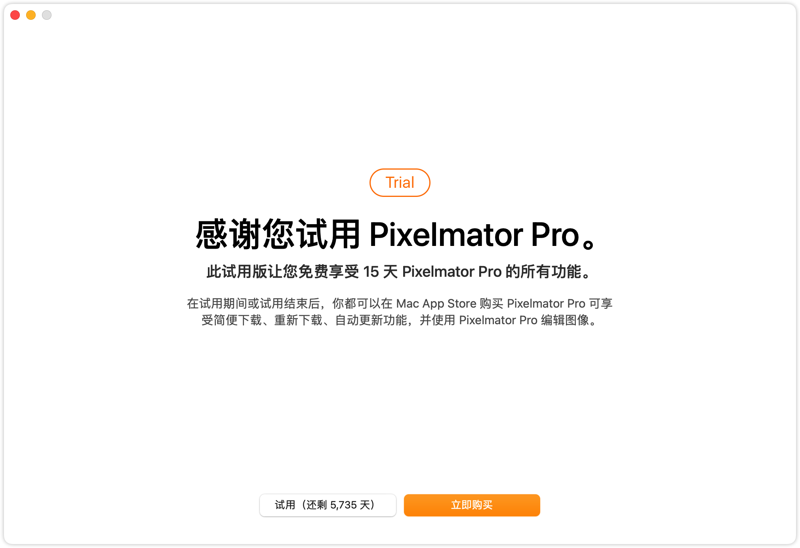
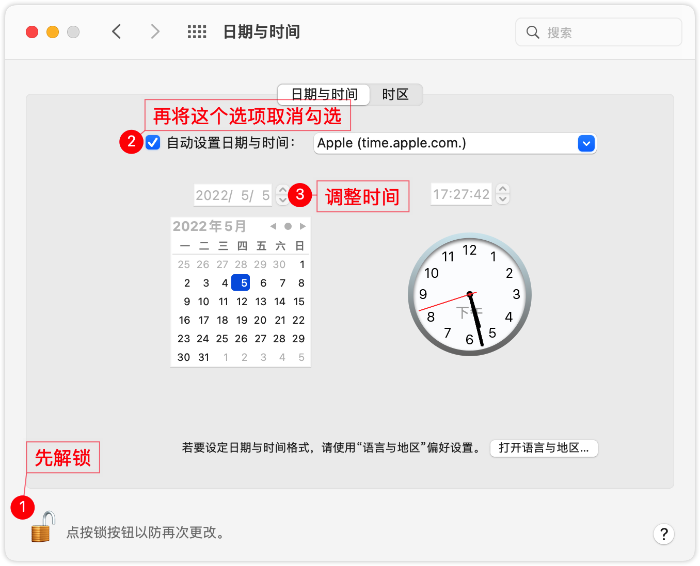

# Mac无限（almost）试用Pixelmator Pro

### 介绍
Pixelmator Pro 是一款专为 Mac 设计的非常强大、美观且易于使用的图像编辑器。本教程并非破解教程，仅仅是通过特殊手段以达到无限试用Pixelmator Pro的目的。

### 思路

App Store版本的`Pixelmator Pro`是付费下载，因此[官网](https://www.pixelmator.com/pro/free-trial/)提供了试用版的`Pixelmator Pro Trial.app`供大家下载。下载下来后，拖入`应用程序`目录进行安装，安装完切记**不要打开！不要打开！不要打开！！！** 然后调整系统时间，往后调整个几十年，越大越好，时间调整完再打开`Pixelmator Pro Trial.app`，会显示有15天试用期，此时完全关掉`Pixelmator Pro Trial.app`，再把时间调整回来，最后打开程序，就会显示较长天数的试用期。如下图：



### 详细步骤

1. 下载并安装，安装完不要打开（基础操作，忽略）

2. 调整系统时间，打开`系统偏好设置`>`日期与时间`按下图进行操作

   

3. 打开`Pixelmator Pro Trial.app`，点击试用，然后完全关闭改程序

4. 再把时间恢复，直接勾选`自动设置日期与时间`就行了

5. 再次打开`Pixelmator Pro Trial.app`，大功告成！

### 补充

后来经过我一点点的尝试，终于找到了记录试用期的文件，删掉这个文件，程序再次启动的时候就会重置15天试用期。因此我们可以按照[unlimited_trial_navicat_premium](https://gitee.com/chaofan2685_admin/unlimited_trial_navicat_premium)里面的方法，使用定时任务加脚本的方式自动的重置`Pixelmator Pro Trial.app`的试用期，脚本如下：

```shell
#!/bin/bash
echo "------------------------------------------------------"
echo 执行时间：$(date "+%Y-%m-%d %H:%M:%S")
echo "------------------------------------------------------"
rm -rf ~/Library/Group\ Containers/4R6749AYRE.com.pixelmator/Library/Preferences/4R6749AYRE.com.pixelmator.plist
echo "------------------------------------------------------"
```

再插一嘴，Navicat Premium 16使用调整安装时间的方式延长试用期不太行，不信邪的也可以自己尝试一下。
